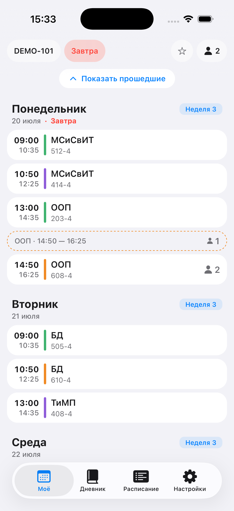
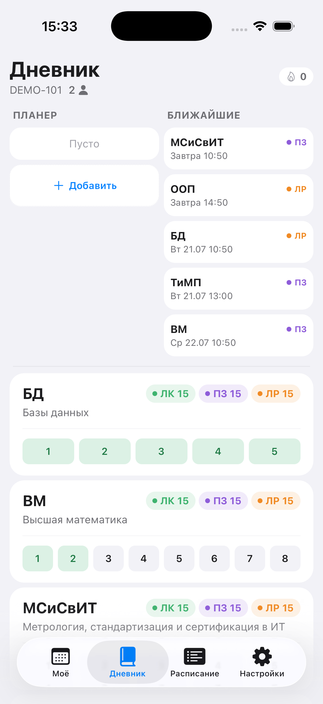
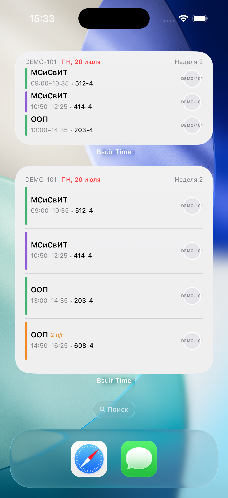
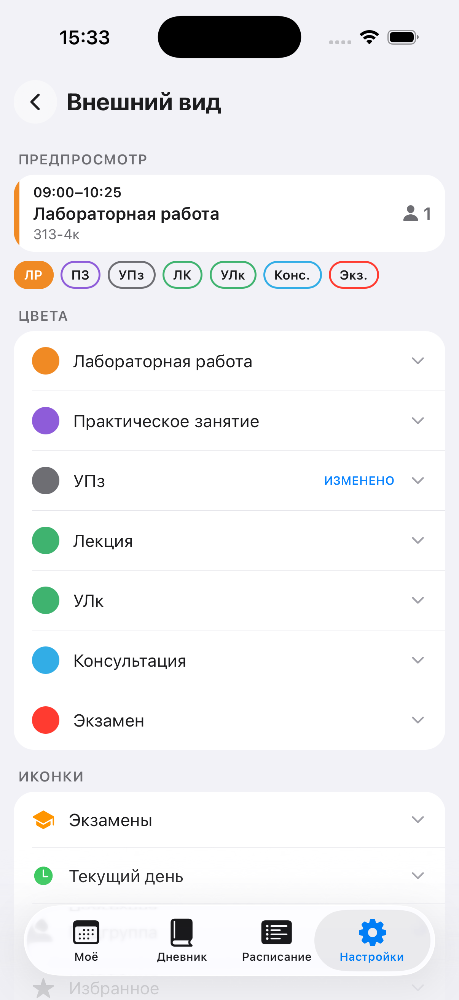

<div align="center">
  

# Bsuir Time

### BSUIR class schedule that feels native — widgets, diary, streaks and cloud sync included

**English** · [Русский](README.ru.md)


[](https://reactnative.dev)
[](https://www.typescriptlang.org)
[](#getting-started)


[](https://apps.apple.com/by/app/bsuir-time/id6762343557)
[](https://play.google.com/store/apps/details?id=by.vazon.bsuirtime)

</div>

---

<!-- screenshots:start -->
<div align="center">
  
  
  
  
</div>
<!-- screenshots:end -->

## Features

- 📅 **Group & lecturer schedules** — BSUIR's 4-week cycle, auto-scroll to the
  current lesson, a live progress bar on the ongoing lesson, exams view, and
  one-off announcements.
- 🔎 **Smart search** — typo-tolerant fuzzy search, digit shortcuts for groups
  (`410` → all matching groups), multi-word lecturer search.
- 📌 **Pinned groups and lecturers** — prefetched in the background, per-entity
  subgroup filter, hide past lessons, block individual lessons you don't attend.
- 🚪 **Auditory free/busy** — see whether a room is free right now and until
  when, powered by a self-hosted [Cloudflare Worker](services/auditory-api/).
- 📓 **Diary & planner** — task grids per subject, drag-and-drop planner and
  progress stats.
- 🔥 **Streak** — daily activity fire with freezes, 7/30/100 milestones, an
  activity calendar and an evening reminder.
- 🧩 **Home & Lock Screen widgets** — WidgetKit on iOS (including Lock Screen
  accessories) and Glance-style widgets on Android, with deep links into the app.
- ⌚ **Apple Watch app** — browse the pinned group's schedule on the wrist
  (today + days/weeks). Synced from the phone via WatchConnectivity, with a
  direct-API fallback when the phone isn't reachable.
- ☁️ **Cloud sync** — iCloud on iOS, Google Drive on Android; offline-first
  with cached schedules as a fallback data source.
- 🎨 **Personalization** — light/dark themes, custom lesson-type colors,
  replaceable icon slots and **24 alternative app icons**.
- 🌍 **Localization** — Russian, Belarusian and English.
- 🇧🇾 **Belarus public holidays** out of the box, plus your own custom days off.
- ♿ **Accessibility** — reduce motion, high contrast and
  differentiate-without-color modes.
- ✨ **Native feel** — real `UITabBarController` tabs, Liquid Glass on iOS 26+
  with graceful fallback, haptics, skeleton loading.

> The app is fully usable without any backend of its own — all schedule data
> comes from the public BSUIR API (`iis.bsuir.by/api/v1`).

## Getting started

Prerequisites: Node.js 20+, Xcode (iOS) or Android Studio + JDK 17 (Android).

```bash
git clone https://github.com/vazonhub/bsuir-schedule.git
cd bsuir-schedule
npm install
cp .env.example .env   # every variable is optional

npm run ios            # or: npm run android
```

> **Expo Go won't work** — native tabs require a dev client, which
> `npm run ios` / `npm run android` builds automatically.

All environment variables are optional; features that need one (Unity Ads,
Google Drive sync, auditory status, EAS builds) simply stay disabled when it
is missing. See [`.env.example`](.env.example).

## Architecture

Strict MVC layering on top of Expo Router 6:

```
app/                  file-based routes (thin re-exports of views)
src/
├── models/dto/       DTO types for iis.bsuir.by/api/v1
├── services/api/     axios wrappers — the only place HTTP happens
├── stores/           Zustand stores (in-memory state)
├── controllers/      API → normalization → store orchestration
├── views/            screens (controllers in, store selectors out)
├── components/       reusable UI without business logic
├── widgets/          Android widget UI
└── theme/ utils/ …   design tokens and helpers
targets/              native iOS widget (WidgetKit), watchOS app & Unity banner view
modules/              local Expo native modules (watch-bridge — WatchConnectivity)
plugins/              Expo config plugins (widgets, watch app, StoreKit, icons, …)
services/auditory-api Cloudflare Worker + crawler for room occupancy
```

Details and ground rules live in [CONTRIBUTING.md](CONTRIBUTING.md).

## Contributing

Issues and PRs are welcome — see [CONTRIBUTING.md](CONTRIBUTING.md) for the
build guide, architecture rules and commit conventions.

## Links

- 📖 [User guide](https://dorian-camera-fc6.notion.site/Bsuir-Time-34ba9d552bd8800e8008d333dace4ada)
- 🔒 [Privacy Policy](https://dorian-camera-fc6.notion.site/Privacy-Policy-for-Bsuir-Time-344a9d552bd880c79b77cd8a6605e653)
- 💬 [Telegram](https://t.me/multibelbet)

## License

[MIT](LICENSE) © Konstantsin Betenya

---

<div align="center">
If Bsuir Time saves your mornings — ⭐ star the repo, it really helps!
</div>
